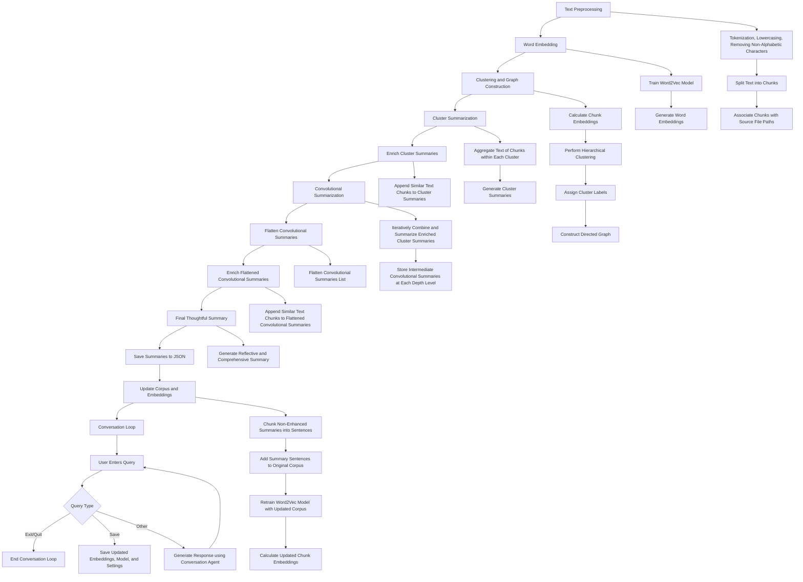

# REPTAR
Recursive / Enriching / Pterodactyl / Tree / Augmented / Retrieval

REPTAR is a system that uses a recursive summarization approach to generate thoughtful summaries of text data. The system first preprocesses the text data, constructs a hierarchical graph, and performs cluster summarization. It then enriches the cluster summaries by appending similar text chunks, iteratively combines and summarizes the enriched cluster summaries, and generates a final thoughtful summary. The system also updates the corpus and embeddings based on the generated summaries and user queries. The system includes a conversation loop where the user can interact with the system using a conversation agent.

